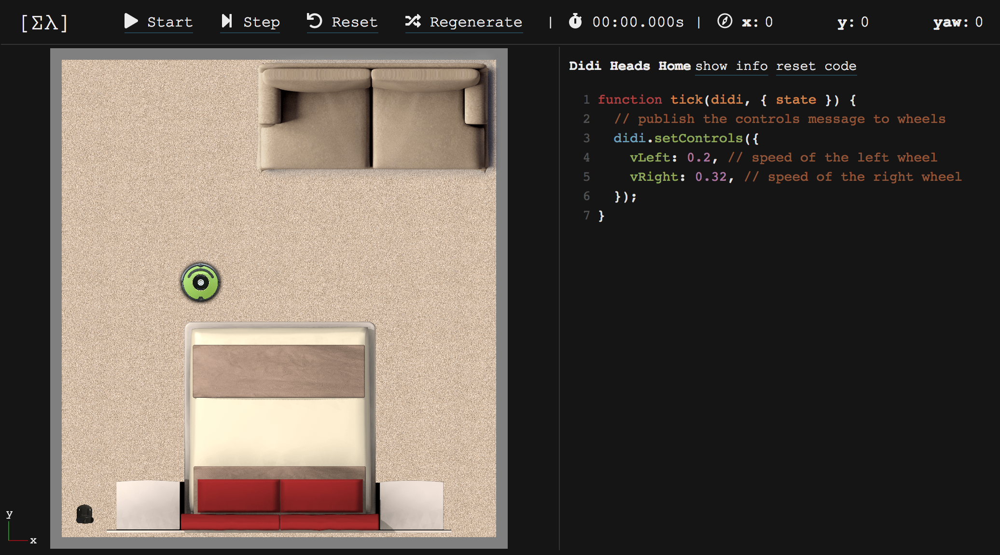

# SPATIAL [Σλ]

Spatial is a game in which you program robots! There are several challenges
to progress through, each one requires learning a new algorithm or technique in
robotics.

[Play Spatial here!](http://spatialgame.xyz)




## Development

This is a WIP, contributions welcomed!

To start it, open a terminal and run

```bash
npm start
```

and then open [http://localhost:3000](http://localhost:3000) in a browser.


## License

This project is licensed under the MIT license, Copyright (c) 2018 Simon Murtha
Smith (and Maximilian Stoiber for react boilerplate portion). For more
information see `LICENSE.md`.
